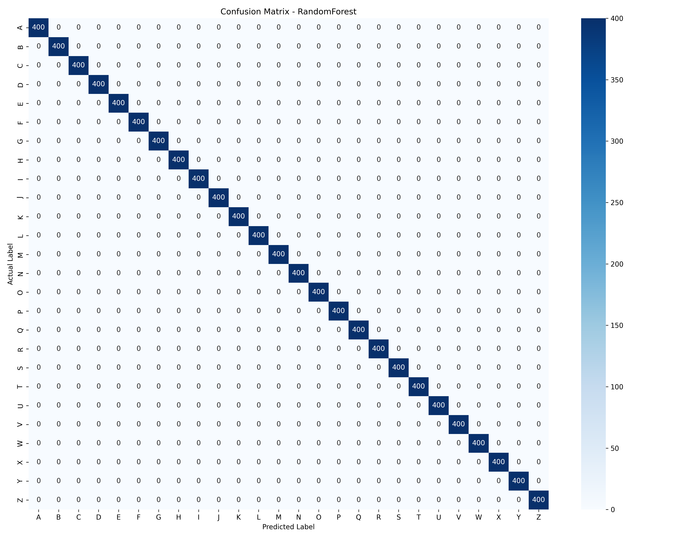

# GestureVerse Model Training Report
Generated at: 2026-06-15 12:22:43

## Model Comparison
| Model | Accuracy | Weighted Precision | Weighted Recall | Weighted F1 | Train Time (s) |
|---|---|---|---|---|---|
| **RandomForest** ⭐️ (Best) | 100.0000%| 1.0000 | 1.0000 | 1.0000 | 2.82s |
| **SVM**  | 100.0000%| 1.0000 | 1.0000 | 1.0000 | 13.04s |
| **XGBoost**  | 99.9423%| 0.9994 | 0.9994 | 0.9994 | 16.33s |
| **MLP**  | 100.0000%| 1.0000 | 1.0000 | 1.0000 | 5.32s |

## Best Model Performance Details
- **Selected Classifier**: `RandomForest`
- **Test Accuracy**: `100.0000%`
- **Confusion Matrix**: 

### Per-Letter Accuracy
| Letter | Accuracy | | Letter | Accuracy |
|---|---|---|---|---|
| **A** | 100.00% | | **B** | 100.00% |
| **C** | 100.00% | | **D** | 100.00% |
| **E** | 100.00% | | **F** | 100.00% |
| **G** | 100.00% | | **H** | 100.00% |
| **I** | 100.00% | | **J** | 100.00% |
| **K** | 100.00% | | **L** | 100.00% |
| **M** | 100.00% | | **N** | 100.00% |
| **O** | 100.00% | | **P** | 100.00% |
| **Q** | 100.00% | | **R** | 100.00% |
| **S** | 100.00% | | **T** | 100.00% |
| **U** | 100.00% | | **V** | 100.00% |
| **W** | 100.00% | | **X** | 100.00% |
| **Y** | 100.00% | | **Z** | 100.00% |

### Top Misclassifications
No misclassifications! Perfect 100% test score reached.

## Feature Importance (Top 15 Invariant Features)
| Rank | Feature | Importance |
|---|---|---|
| 1 | `dist_thumb_wrist` | 0.06993 |
| 2 | `dist_thumb_index` | 0.06940 |
| 3 | `ratio_0` | 0.06032 |
| 4 | `lm_4_y` | 0.05669 |
| 5 | `lm_3_y` | 0.04158 |
| 6 | `lm_2_y` | 0.03756 |
| 7 | `dist_index_middle` | 0.03189 |
| 8 | `lm_11_y` | 0.02713 |
| 9 | `dist_middle_wrist` | 0.02671 |
| 10 | `lm_10_y` | 0.02670 |
| 11 | `lm_8_y` | 0.02566 |
| 12 | `dist_index_wrist` | 0.02550 |
| 13 | `middle_extension` | 0.02346 |
| 14 | `lm_7_y` | 0.02330 |
| 15 | `lm_6_y` | 0.02244 |
